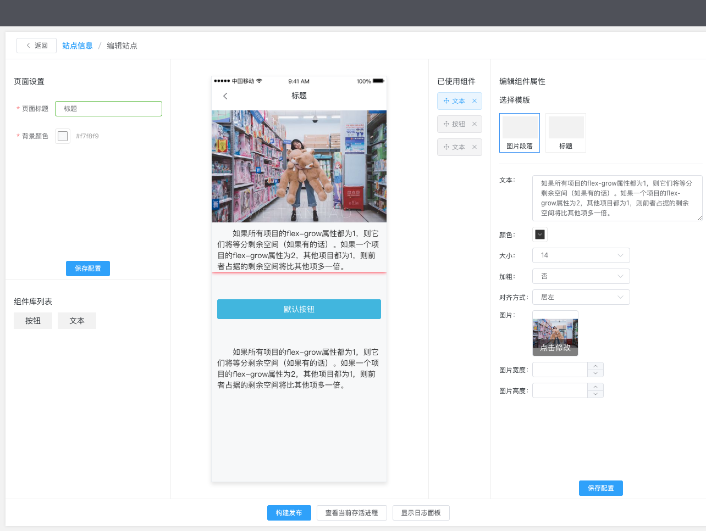

# page-design

站点交互搭建端

- [x] vue-socket.io
- [x] ssr渲染，预览时未将组件数据一起打包、构建发布时将组件数据渲染后直出
- [ ] 编辑站点加锁
- [x] 组件schema样式美化
- [ ] 多页面交互
- [ ] 布局组件
- [ ] 组件拖拽

links

- [page-pipepline](https://github.com/page-pipepline)
- [vue-design](https://cnodejs.org/topic/5aae5c6be7b166bb7b9ecb91)

#### changelog

2019/02/15

- [x] 模版与组件更新机制
- [x] 丰富完善按钮与文本组件
- [ ] 图片组件
